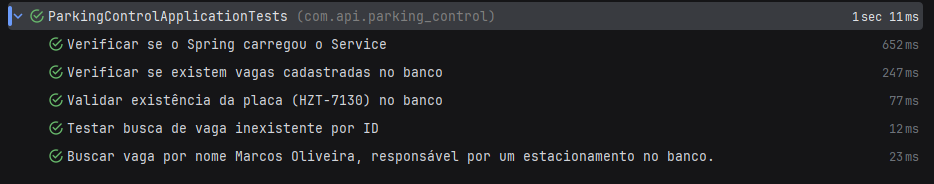

**Sobre o projeto usado:** Um sistema sistema para gerenciar reservas, ocupação e liberação de vagas de estacionamento, desenvolvido com Java, Spring Boot e PostgreSQL. Contando criação, atualização e remoção de vagas.

obs: Ao executar projeto ele já insere dados exemplos para os testes no banco.


3. **Configurar o Banco de Dados**

Executando localmente com **PostgreSQL**

- Edite o arquivo `application.properties`:

```properties
spring.datasource.url=jdbc:postgresql://localhost:5432/parking-control-db
spring.datasource.username=<USERNAME>
spring.datasource.password=<PASSWORD>
```


### Testes Realizados

Nesta etapa, foram executados testes de integração para validar as regras de negócio e a comunicação entre o serviço e o banco de dados PostgreSQL.

| Teste | O que faz                                       | Descrição                                                                  |
| :--- |:------------------------------------------------|:---------------------------------------------------------------------------|
| **1** | Verificar se o Spring carregou o Service        | Valida que o Spring inicializou certo e o ParkingSpotService foi injetado. |
| **2** | Verificar se existem vagas cadastradas no banco | Garante que a lista retornada pelo `findAll()` não está vazia.             |
| **3** | Validar existência de placa                     | Confirma que a placa **HZT-7130** existe no banco.                         |
| **4** | Testar busca de vaga inexistente por ID         | Verifica que buscar o ID `9999` retorna um `Optional` vazio.               |
| **5** | Buscar vaga por nome do responsável             | Busca a vaga da responsável **Marcos Oliveira** e ve seu retorno.          |
| **6** | Criar uma nova vaga com sucesso                 | Cria nova vaga **E-01** e confirma que foi corretamente no banco.          |


Os testes desenvolvidos podem ser acessados diretamente no repositório:
👉 [Acessar pasta de testes](https://github.com/seu-usuario/seu-repo/tree/main/src/test/java/com/seuprojeto/parkingcontrol)


Resultado dos testes: 



